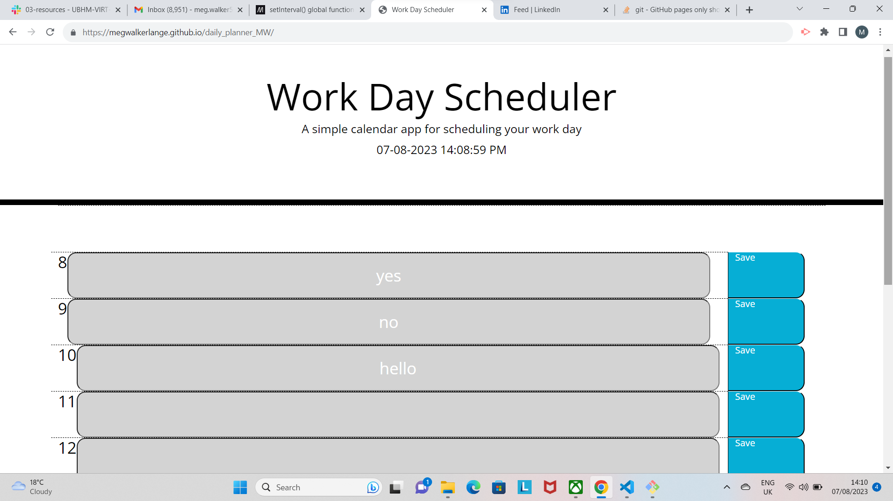

# daily_planner_MW

A simple daily planner app

This project is to complete a simple day planner app to log a schedule during the working day. This project has been completed using Jquery and Dayjs.

I have found this project an interesting one to work and it has definiately helped me get to grips with Jquery, as I did not particualrly enjoy using it in class sessions. I also attempted to create as much HTML dynamically as possible, as I did not attempt this in the previous challenge, and I feel much more confident doing so. However, the result was that by creating so many elements in JavaScript it made my code more difficult to read and overly complex. I now need to focus on understanding on how to get the balance right and having a better understanding of when elements need to be dynamic.

This project also helped consolidate my understanding of Local Storage.

Code from tutor session with Jili Jiang to review Local Storage:

Lines 47

Lines 65-67

https://megwalkerlange.github.io/daily_planner_MW/

